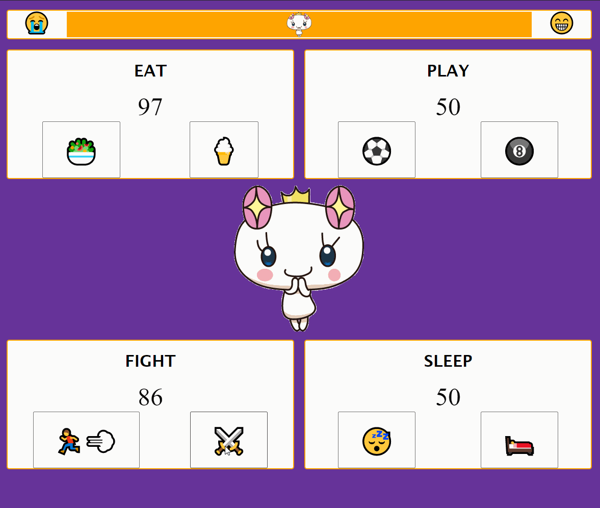

# Tamagotchi

This project was an example of using webpack to  organize files and sass to style.

The buttons affect the values of each stat, and affect other stats based on what's pressed. The progress bar at the top shows overall happiness.

## Preview

## Technologies Used

     

## View Project

* Clone the repository `$ git clone git@github.com:spotmonk/tamagotchi.git`
* Install dependencies with `$ npm install`
* Run with `$ npm start`
